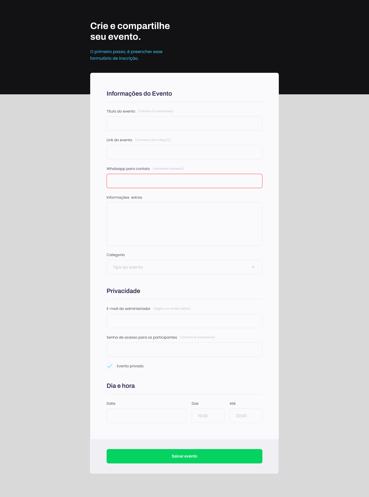

<h1 align="center"> Projeto 03 </h1>

  <a href="#-tecnologias">Tecnologias</a>&nbsp;&nbsp;&nbsp;|&nbsp;&nbsp;&nbsp;
  <a href="#-projeto">Projeto</a>&nbsp;&nbsp;&nbsp;|&nbsp;&nbsp;&nbsp;
  <a href="#-layout">Layout</a>&nbsp;&nbsp;&nbsp;

 

  

## 🚀 Tecnologias

Esse projeto foi desenvolvido com as seguintes tecnologias:

- HTML e CSS
- Figma

## 💻 Projeto

Esse projeto foi desenvolvido com o intuito da criação de um formulário online para a realização de eventos.
- [Acesse o projeto finalizado, online](https://devbonatto.github.io/Projeto03/)

## 🔖 Layout

Você pode visualizar o layout do projeto através [DESSE LINK](https://www.figma.com/file/sgcJKpGAeVqh7rf2pwsOd9/Explorer-Stage-03-Projeto-01/duplicate).
